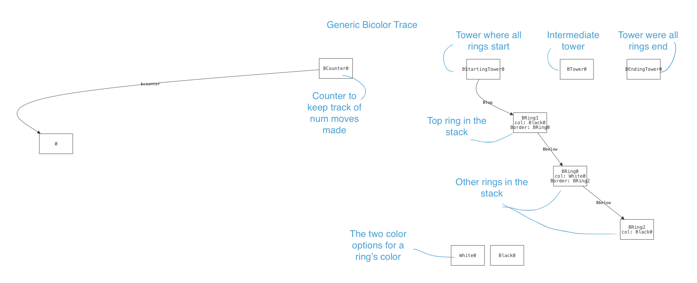

# cs1710finalproject

## Initial Proposal + First Attempts

Initially, we proposed modeling the card game, Uno. We thought about modeling a trace from start to end in order to look at win conditions and the different scenarios which would guarantee a win. However, when we began modeling, we ran into major performance issues, which made this idea lose its appeal. We tried using an optimizer to limit the scope of Card instances, and we even cut down on the number of players to 2 and the nubmer of cards to 20, but running just a simple trace would take a long time. In the end, we found that removing the concept of a deck (which keeps track of the cards that can be drawn) sped up the runtime significantly. We realized that we couldn't model a full trace, and needed to focus more on the properties of transitions, but given how much we cut down the model, we did not have many concrete properties we were interested in investigating.

## New Model: Towers of Hanoi

We changed our project idea to the Towers of Hanoi. This is a puzzle in which there are multiple pegs/towers, and a stack of various sized rings on one tower. The goal is to get all rings to a different tower, moving one ring at a time and ensuring that a larger ring is never placed on top of a smaller ring.

In addition, we wanted to explore several variations of this puzzle and see how they compared. The variations are colored towers and magnetic towers. We chose this idea because we were introduced to this puzzle to learn recursion for the first time, so we thought it would be interesting to explore other properties that it may be useful in demonstrating.

### Bicolor towers

In this variation of the Towers of Hanoi, each ring has one of two colors. The initial tower starts with the rings alternating in color. The goal is to get all rings to another tower without allowing two rings of the same color to be stacked. The basic size constraint of the original puzzle applies here as well.

### Magnetic towers

In this variation of the Towers of Hanoi, each ring has magnetic poles, with either the North side facing up or the South side facing up. The initial tower starts with all rings facing in the same direction. Everytime a ring is moved, the ring must be flipped. The goal is to get all the rings to another tower without allowing two rings to have the same pole facing each other (as this would prepel the rings). The basic size constraint still applies here as well.

### Demo Video
To view our demo video, click <a href="https://drive.google.com/drive/folders/1qcYuzE15HGw3t8fxESK-cE-88l8aIY73?usp=sharing"> here! </a>

## Directory Structure

- **TowersofHanoi:** contains files for Towers of Hanoi model

  - **GenericModels:** folder that contains model and test files for all variations (basic, magnetic, bicolor). These models allow for varying number of Rings and Towers, and also has a Counter to keep track of minimum number of moves. Useful for looking at wider scope of traces.
    - **bicolor.test.frg:** test suit for generic bicolor model
    - **bicolorGeneric.frg:** generic bicolor model
    - **magnetic.test.frg:** test suite for generic magnetic model
    - **magneticGeneric.frg:** generic magnetic model
    - **towers.test.frg:** test suite for generic towers model
    - **towersGeneric.frg:** generic basic model
  - **Models:** folder that contains model and test files for all variations (basic, magnetic, bicolor). These models only allow for strictly 3 Rings and 3 Towers. Useful for optimizing runtime because less flexible.
    - **bicolor.test.frg:** test suit for bicolor model
    - **bicolorTowers.frg:** bicolor model
    - **magnetic.test.frg:** test suite for magnetic model
    - **magneticTowers.frg:** magnetic model
    - **towers.frg:** basic model
    - **towers.test.frg:** test suite for basic model
  - **correspondence.test.frg:** file that contains tests for our main goal of finding correspondence. Does not use generic models for optimization reasons.

- **Uno:** contains files for initial Uno model

- **images:** contains images used for README
- **README.md**

## Running our model

For all models, there will be Tower sigs and Ring sigs. To clear up the graph, we suggest following these
steps:

### For Basic trace

#### (towers.frg OR towersGeneric.frg)

1. Use this run statement: "run {trace} for exactly 3 Ring, 3 Tower"
2. (If running towersGeneric.frg: In the visualizer, click "theme" > click "order" > select "display as attribute")

### For Magneitc trace

#### (magneticTowers.frg OR magneticGeneric.frg)

1. Use this run statement: "run {Mtrace} for exactly 3 MRing, 3 MTower"
2. In the visualizer, click "theme" > choose to display the following as attributes: tpole, pole
3. (If running magneticGeneric.frg: Also display "Morder" as attribute)

### For Bicolor trace

#### (bicolorTowers.frg OR bicolorGeneric.frg)

1. Use this run statement: "run {Btrace} for exactly 3 BRing, 3 BTower"
2. In the visualizer, click "theme" > choose to display the following as attributes: col
3. (If running bicolorGeneric.frg: Also display "Border" as attribute)

## How to interpret our model

All models will have Tower and Ring sigs. The Ring's below field defines the stack order of the rings, and the Tower's top field defines which stack belongs to the tower. For Bicolors, there will also be a col field, which defines the ring's color. For Magnetic, there will be a pole field defining the Ring's polarity, and a tpole field defining the Tower's polarity.

In all generic versions of the model, there will be an order field, which acts as the pre-defined size order of the rings. (If Ring1's order is Ring2, that means Ring2 is expected to be right below it if the rings are properly ordered by size).

Below is an example running the generic bicolor model, with explanations for the sigs and fields.

As we step through the time states, the "below" and "top" arrows will change, reflecting a ring moving from one tower to another.

## Goals

The main goal is to see if there is correspondence between the variations of the puzzle. In other words, given a trace that satisfies the constraints of one puzzle, would it satisfy the constraints for the other? And is the reverse true?

Some other secondary questions/properties we were curious about:

- What is the minimum number of moves required to satisfy each puzzle?
- If we increase or decrease the number of rings and towers, does the minimum number of moves change?
- Are there patterns for solving the puzzle?
- Are there constraints that make the puzzle impossible to solve?

## Design Choices and Tradeoffs

### "Generics" vs. "Towers"

We started out modeling the three versions using exactly 3 Rings and 3 Towers. These versions are the forge files with "Towers" in their name. We kept them because we found that hardcoding a specific number of Ring and Tower sigs significantly sped up our correspondence tests (which we were running on 3 rings and 3 towers anyways). We didn't use a counter for these versions because the model only works with 3 Rings and 3 Towers, so looking at trace length here wasn't interesting.

We then moved on to more generic versions of our models (files with "Generics" in the name), which allow for varying number of Rings and Towers. We used this version to look at the trace length property (which corresponds to the minimum number of moves it requires to solve the puzzle) because we thought it would be interesting to compare how the trace length changes when the number of towers or rings changes. However, since there is more flexibility in these models, we found that some tests take a long time to run (like correspondence). The tradeoff was flexibility for runtime.

### Tower's Top Field

We decided to keep track of the top ring for each tower so we know which stack belongs to which tower. Also, since each Ring keeps track of the ring below it, there wouldn't be a need for each Tower sig to keep track of all of its rings, just the very top.

## Overview of Sigs and Predicates

### Sigs

Although we worked with a lot of model variations, the main Sigs are for Ring and Tower, and the basic predicates are init, totalMoves, doNothing, wellformed, and endState, which are all needed to run a successful (generic) trace from start to end. In the non-generic versions (which use move instead of totalMoves because it doesn't have a counter), there was no need for a do nothing transition.

In the basic model, **Ring** has the _below_ field to keep track of which ring it is stacked on. **Tower** has a _top_ field to keep track of the top ring in its stack. In the magnetic variation, Ring has a _pole_ field to keep track of which pole is faced up, and Tower also has a _tpole_ polarity field which restrics which state of rings can be stacked on it. In the colored variation, Ring has an additional _col_ property to keep track of color but Tower stays the same as the basic model. In all generic versions of the models, the Ring Sig has an _order_ field to establish proper size order of the rings.

### Predicates

**Init** specifies the state of the starting tower, which guarantees that all rings are in a linear stack from the starting tower. **Wellformed** ensures that no rings are stacked on smaller rings (along with other constraints for the other variations, such as ensuring alternating colors for bicolors, and ensuring same-facing disks for magnetic). **Total moves** specifies the action of moving one ring from one tower to another, and ensuring all other rings remain in place. **Do nothing** keeps everything the same, which was useful for stopping the counter. **End state** specifies the state of the ending tower, which guarantees that all rings are in a linear stack from the ending tower.

## Challenges, Assumptions and Limitations

- Tracking the trace lengths using a counter was difficult, we were running into an issue where our counter can increment or decrement by any number other than 1. We posted on Ed, and were told it was due to forge looking for a way to loop back to a previous state in a lasso trace, but not being able to because the counter was always incrementing. Therefore, we needed to add a "do nothing" transition that allowed the counter to stop counting.

- Since it has been mathematically proven that the minimum number of moves for the standard Towers of Hanoi puzzle is 2^n - 1, (where n is the number of rings) we could not experiment with very high numbers of rings, as the trace length would grow exponentially and the performance costs would be too high. 

- Though we were able to compare correspondene in the 3 Ring, 3 Tower case, we had to make optimizations to improve runtime. That meant looking for correspondence in the 4 Ring, 3 Tower would not be possible without waiting for even longer. In addition, we had to define a max trace length in our model files, (and though we knew the minimum trace length), this meant the correspondence tests were limited in which traces it could look at.

- We checked trace length properties using tests that limit the Counter. However, some tests take a really long time to run. To work with this, we ran the trace and checked if it was satisfiable after modifying "option_max_trace_length." This helped us find the minimum number of moves / minimum trace length.

## Testing

### Main tests

For our goal of proving / disproving correspondence, we wrote tests in the "correspondence.test.frg" file. These tests check that if one model follows its wellformed property, and we force another model to run correspondingly, if the other one will also always be wellformed. For example, if we run a trace solving the magnetic puzzle, and we make the corresponding moves for the basic puzzle, we check if the basic puzzle is guaranteed to always be wellformed (if all rings always maintian the correct order). Similarly, we also checked the reverse: If we run the basic puzzle and make the corresponding moves for the magnetic puzzle, we check if the magnetic puzzle is always wellformed.

We repeat the above steps for all pairs of our three models, resulting in six different tests.

We defined correspondence as there always being the same number of rings per tower, for all towers. In other words, moving Ring 1 to Tower 2 corresponds to moving Magnetic Ring 1 to Magnetic Tower 2.

### Testing Summary 

- Test to see if there is correspondence between the magnetic variation and the bicolor variation (if given a trace that satisfies the magnetic constraints, will it always satisfy the colored version?)
- Verify that both magnetic and bicolored variations correspond to basic version (expected, bc they are just extensions of original puzzle)
- Test that min trace length for basic towers = 7, but is satisfiable in more steps (using counter)
- Test that min trace length for magnetic towers = 13, but is satisfiable in more steps (using counter)
- Test that min trace length for colored towers = 7, but is satisfiable in more steps (using counter)
- Test that changing the number of towers to 2 makes the puzzle unsat for all three variations
- Test that changing the number of towers to 4 decreases the minimum trace length for all three variations
- Verify that no disk will ever be placed on a disk smaller than it
- Verify that in magnetic variation, all disks in a tower will have same polarity
- Verify that in bicolored variation, no two disks of the same color are placed on each other
- Verify that init and endstate are equivalent for all variations
- For each puzzle, verify the expected trace length for two disks + three towers, four disks + three towers, etc
- Verify all are guaranteed to be wellformed
- Test if the pattern of moving the smallest ring every other turn is necessary for minimum trace
- Basic unit testing for predicates

## Tool Choices and Justification

- Temporal forge: \
  Although we considered basic forge for this model, we ended up choosing temporal because it offers the option to limit trace length, which is especially helpful when considering that we generally know how long a trace should be. We also liked that it allows us to compare the traces at every step in time (so that there is no need to keep a separate State sig).

- Visualizer: \
  We decided to use the default visualizer because we found that the graphs with the boxes and arrows were sufficient in visualizing the stack of rings for each tower. If we were to make a customized visualizer based on the ideal visualization, it would look similar to the default, but with some properties being more distinct (like color, or polarity). However, we found that when we display those proeprties as attributes (and they get written as a label), this explicit identification was easy to follow.

## Stakeholders

- Programmers / Mathematicians: Since the Towers of Hanoi is a puzzle used primarily to demonstrate recursion and induction, this model could be useful for beginner programmers and mathematicians (who might want a visual representation without having to physically make the model)

- Puzzle Players: People who are generally interested in puzzles may be interested because they can look at how the model solves the the puzzle, and compare different versions of the puzzle using this model.

## Takeaways

- We found that there is no correspondence between the magnetic towers and bicolor towers (at least in the 3 disk, 3 tower case). This is because a disk can be stacked on a disk two sizes below it, providede that the polarities are the same. For the bicolor trace, however, this can never be true because they will always be the same color regardless of which move is made. Similarly, when a disk is flipped, its relationship to the disk immediately below is not guaranteed to be consistent the same way the bicolor towers is. For example, if the smallest disk in the magnetic towers is flipped, it no longer can be placed on the second smallest disk. However, this is not true with bicolors, as the smallest disk is always guaranteed to be able to stack on top of the one immediately below (since the colors are alternated).

- We also verified that there is correspondence between the magnetic towers with the default towers, as well as the bicolor towers with the default towers. This was not as surprising because the bicolor towers are an extension of the default puzzle, with the additional restriction of not placing two similar colored disks. Similarly, the magnetic towers corresponding with the default was not surprising because the magnetic variation is extension of the default with the additional constraints of flipping the disks and preventing disks of opposite-facing polarity from stacking. Since both variations still require the disks to be ordered by size, there is a guarantee of correspondence. (However, it is important that the correspondenve is one-way only. If given either a wellformed magnetic or bicolored trace, the corresponding basic trace is not guaranteed to be wellformed.)

- We also learned the importance of scaling a model. We started with Uno without fully understanding the runtime limitations, which ended up interefering with our modeling goals. Therefore, when we switched to Towers of Hanoi, we were more careful about prioritizing more reasonable goals given the scale of the model.
